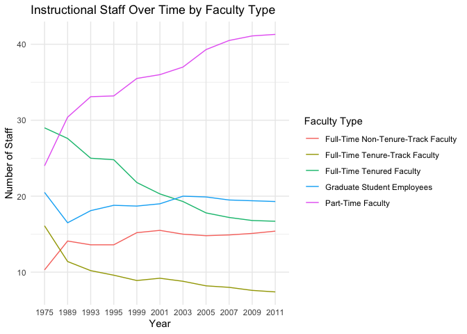

Lab 06 - Ugly charts and Simpson’s paradox
================
Anahatt Virk
07/04/2025

### Load packages and data

``` r
library(usethis)
use_git_config(
  user.name = "Anahatt Virk",
  user.email = "virka22@wfu.edu")
```

``` r
library(tidyverse) 
library(dsbox)
library(mosaicData) 
```

### Exercise 1

``` r
staff <- read_csv("data/instructional-staff.csv")
```

    ## Rows: 5 Columns: 12
    ## ── Column specification ────────────────────────────────────────────────────────
    ## Delimiter: ","
    ## chr  (1): faculty_type
    ## dbl (11): 1975, 1989, 1993, 1995, 1999, 2001, 2003, 2005, 2007, 2009, 2011
    ## 
    ## ℹ Use `spec()` to retrieve the full column specification for this data.
    ## ℹ Specify the column types or set `show_col_types = FALSE` to quiet this message.

``` r
staff_long <- staff %>%
  pivot_longer(cols = -faculty_type, names_to = "year") %>%
  mutate(value = as.numeric(value))

staff_long
```

    ## # A tibble: 55 × 3
    ##    faculty_type              year  value
    ##    <chr>                     <chr> <dbl>
    ##  1 Full-Time Tenured Faculty 1975   29  
    ##  2 Full-Time Tenured Faculty 1989   27.6
    ##  3 Full-Time Tenured Faculty 1993   25  
    ##  4 Full-Time Tenured Faculty 1995   24.8
    ##  5 Full-Time Tenured Faculty 1999   21.8
    ##  6 Full-Time Tenured Faculty 2001   20.3
    ##  7 Full-Time Tenured Faculty 2003   19.3
    ##  8 Full-Time Tenured Faculty 2005   17.8
    ##  9 Full-Time Tenured Faculty 2007   17.2
    ## 10 Full-Time Tenured Faculty 2009   16.8
    ## # ℹ 45 more rows

``` r
staff_long %>%
  ggplot(aes(x = year, y = value, group = faculty_type, color = faculty_type)) +
  geom_line() +
  labs(title = "Instructional Staff Over Time by Faculty Type", x = "Year", y = "Number of Staff", color = "Faculty Type") +
  theme_minimal()
```

<!-- -->

### Exercise 2

To show that the proportion of part-time faculty have gone up over time,
I would change the previous plot in order to show the proportions within
each year, instead of the raw counts. The y-axis label would have to be
updated to reflect proportions instaed of number of staff. The updated
graph has been included below.

``` r
staff_prop <- staff_long %>%
  group_by(year) %>%
  mutate(proportion = value / sum(value)) %>%
   ungroup()
```

``` r
staff_prop %>%
  ggplot(aes(x = year, y = proportion, group = faculty_type, color = faculty_type)) +
  geom_line() +
  labs(title = "Proportion of Instructional Staff by Faculty Type Over Time", x = "Year", y = "Proportion of Staff", color = "Faculty Type") +
   theme_minimal()
```

<!-- -->

### Exercise 3

…

Add exercise headings as needed.
